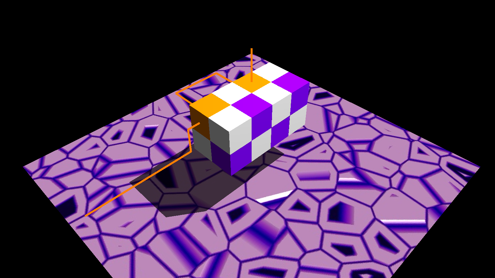

# Blocks

Puzzle game written circa 2009.
The goal is to pass the line through all the passable blocks without self-intersecting or hitting a solid block.

## Misc.

The game originally used PhysX 2, and GLUT, but physics were removed and GLFW and ImGui have been used for windowing and UI.

